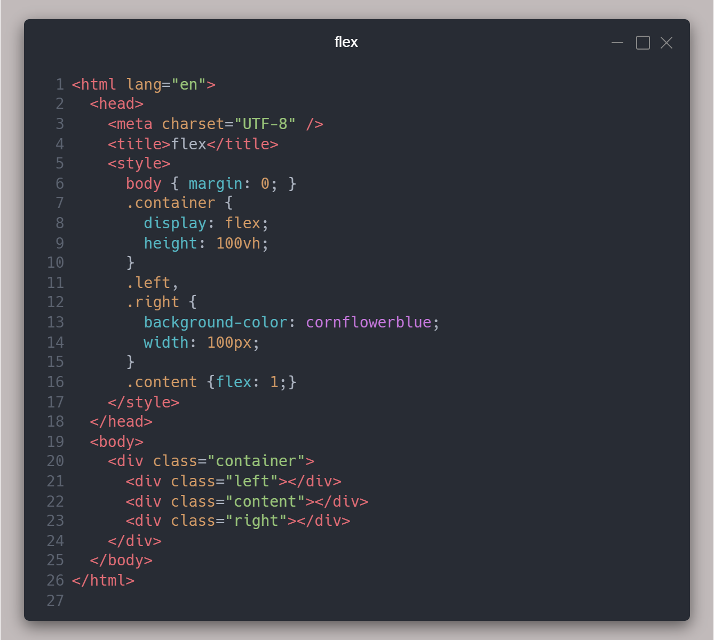

> 日期：/2022/04/01
分类：CSS
题目：动手实现一个左右固定100px，中间自适应的三列布局(至少三种)

1. flex：content使用flex:1属性;
2. calc：水平排列，中间使用calc(100vw - 200px)；
3. grid：使用grid-template-columns: 100px auto 100px；
4. absolute：父相子决，通过left，right实现；
5. table布局
6. float布局

.png)

.png)

.png)

