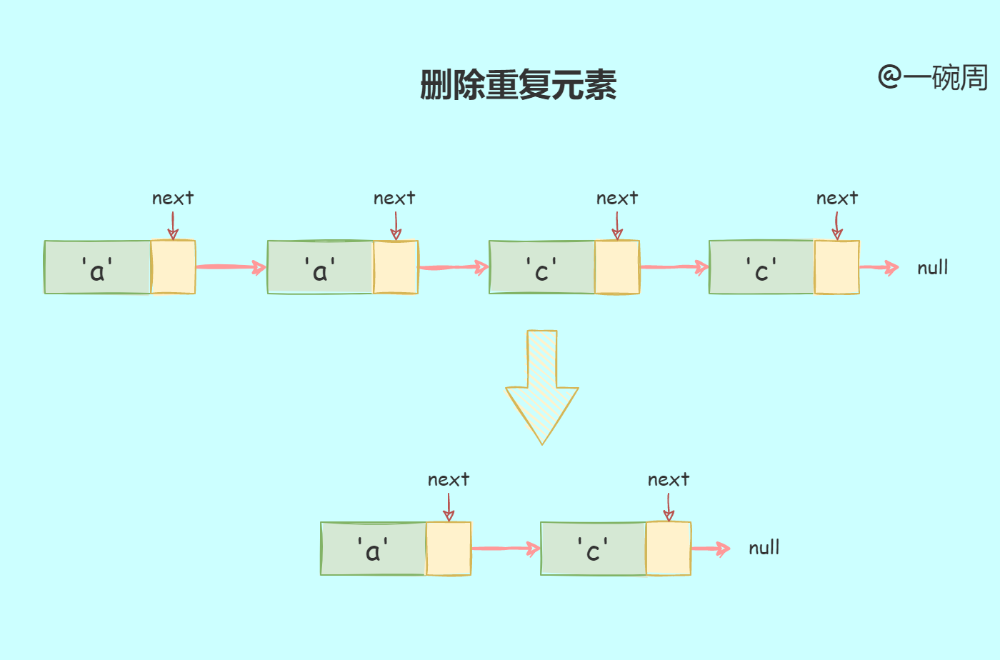
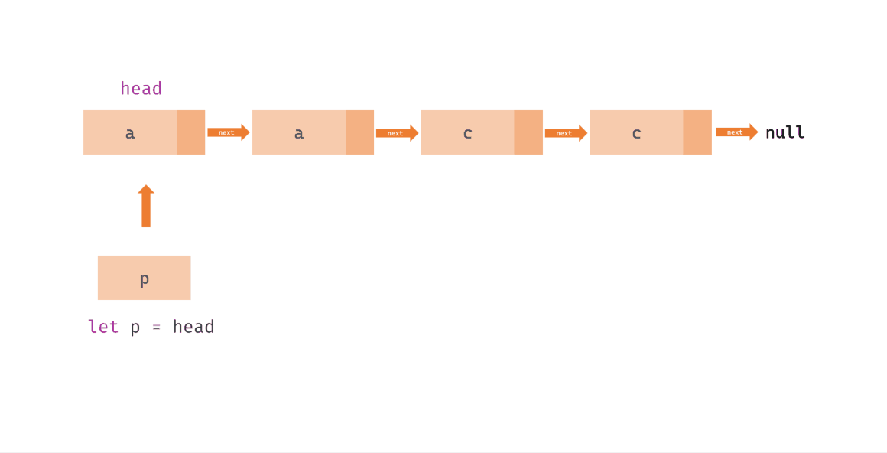

# 第227题：删除排序链表中的重复元素

> 日期：2022/06/10
> 分类：力扣、算法
> 题目：给定一个已排序的链表的头 head ， 删除所有重复的元素，使每个元素只出现一次 。返回 已排序的链表&#x20;

题目分析



**题目分析：**

*   首先我们需要遍历这个列表，并判断当前与下一个是否相等

*   如果相等将删除元素

*   如果不相等将指针指向下一个

实现代码如下：

```javascript
/**
 * @param {ListNode} head
 * @return {ListNode}
 */
var deleteDuplicates = function(head) {
    let p = head
    while (p && p.next) { // 判断p是否为null以及p.next是否存在，p.next不存在说明他是最后一个节点
        if (p.val === p.next.val) {
            p.next = p.next.next
        }else {
            p = p.next
        }
        
    }
    return head
};
```

运行过程如下图：


